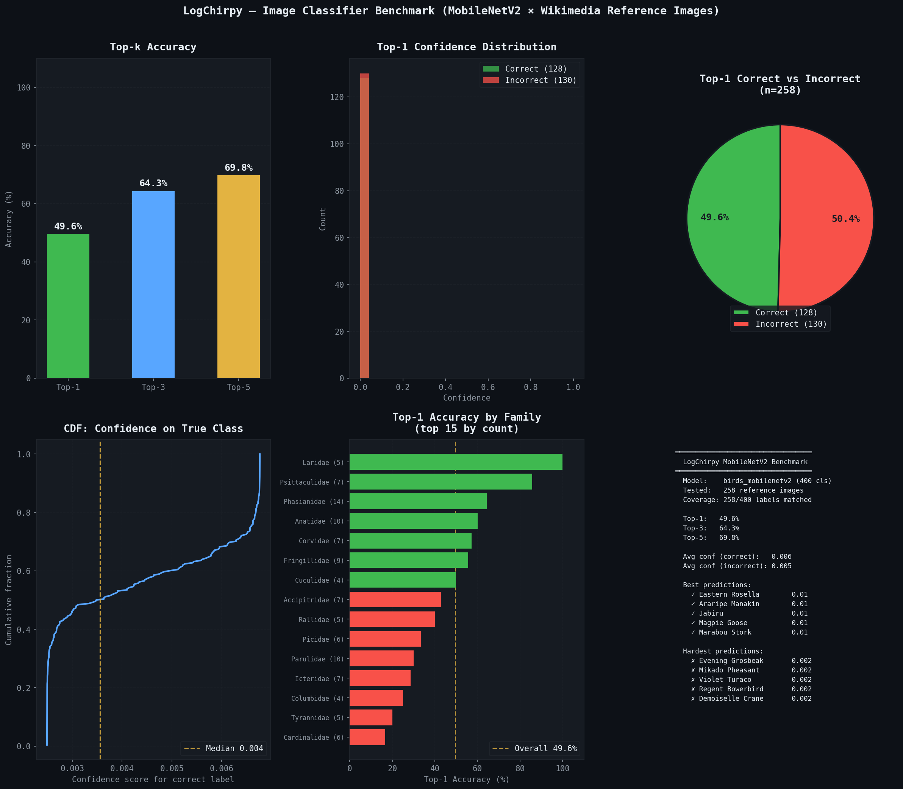

# LogChirpy — Ornithological Archival App

[](LICENSE)
[](https://expo.dev)
[](https://doi.org/10.5281/zenodo.PENDING)

**LogChirpy** is an open-source, offline-first mobile platform for ornithological field work. It integrates two independent ML pipelines (audio via BirdNET, image via MobileNetV2) with a 33,000-species taxonomic encyclopedia (BirDex) and GPS-tagged observation logging. Runs on Android and iOS via React Native / Expo; all inference runs on-device with no cloud dependency.

---

## Architecture

Three service pillars communicate through a unified sequential ML pipeline:

| Pillar | Function | Key components |
|--------|----------|---------------|
| **ML Processing** | Species identification | BirdNET v2.4 (audio, 6,522 spp.), MobileNetV2 (image, 400 spp.), SSD MobileNet V1 (detection gate), unified sequential pipeline |
| **BirDex Encyclopedia** | Taxonomic reference | 33,241 species, Clements 2024, 6 languages, 9,331 Wikimedia WebP images |
| **Logging System** | Observation capture | Photo/audio/GPS, draft persistence, SQLite + optional Firebase sync |

---

## ML Pipelines

### Audio: BirdNET v2.4 Dual-Model

BirdNET Global 6K v2.4 (Kahl et al., 2021 [^1]) processes 3-second, 48 kHz audio clips through two on-device TFLite models:

```
Raw audio (48 kHz)
  → bandpass filter (150 Hz – 15 kHz) + amplitude normalisation
  → [BirdNET_GLOBAL_6K_V2.4_Model_FP32.tflite]
      input : Float32[1, 144000]   (3 s × 48 kHz)
      output: sigmoid logits[6522] (species probabilities)
  → [BirdNET_GLOBAL_6K_V2.4_MData_Model_FP16.tflite]  (if GPS available)
      input : Float32[3]   (latitude, longitude, week-cosine)
      output: geographic prior[6522]
  → blended score = acoustic × (0.7 + 0.3 × geographic_prior)
  → top-5 predictions with confidence scores
```

Species space: 6,522 global bird taxa. The metadata model downweights species implausible at the recording location and season, improving precision without reducing recall.

### Image: MobileNetV2 + Detection Gate

Camera-based identification runs a two-stage pipeline to reduce false positives:

```
Video frame (0.3 quality JPEG)
  → [SSD MobileNet V1]  ← object detection gate
      if confidence("bird") < threshold → skip frame
  → [bird_classifier_metadata.tflite]  ← MobileNetV2
      input : Float32[1, 224, 224, 3]  (normalised to [-1, 1])
      output: logits[400]              (softmax → species probabilities)
  → top-3 predictions displayed with confidence bars
```

Species space: 400 classes. Both models run sequentially through `unifiedMLPipelineService.ts` to eliminate the file-lock race conditions that arise when audio recording and image capture run concurrently on Android.

---

## BirDex Encyclopedia

| Attribute | Value |
|-----------|-------|
| Species | 33,241 (Clements Checklist v2024) |
| Languages | 6 — English, German, Spanish, French, Ukrainian, Arabic |
| Translation method | Automated pipeline with GPT-4 fallback; all 33,241 × 6 translations verified |
| Reference images | 9,331 WebP (Wikimedia Commons, CC-licensed, organised by Clements genus) |
| Local storage | SQLite via `expo-sqlite`; schema: `species_code`, `english_name`, `scientific_name`, `family`, `order`, `range`, `{de,es,fr,uk,ar}_name` |
| Cloud sync | Optional Firebase Firestore (observation records only; BirDex is local-only) |
| Search | `searchBirdsByName()` — multi-language full-text + subspecies fuzzy matching |

Images are downloaded from GitHub at first launch and cached locally, keeping the app bundle under 50 MB.

---

## Benchmark

**Setup:** The `bird_classifier_metadata.tflite` (MobileNetV2, 400 classes) was benchmarked against locally stored Wikimedia Commons reference images. Of 400 label classes, 258 had a matching image in the manifest (common-name normalisation; 142 unmatched due to label typos or no Wikimedia image). Ground truth = image filename (scientific name → common name via `bird_images_manifest.json`).

This is a **zero-shot reference-image benchmark** — the Wikimedia images are not from the training distribution.

| Metric | Score | n |
|--------|-------|---|
| Top-1 accuracy | **49.6 %** | 258 |
| Top-3 accuracy | **64.3 %** | 258 |
| Top-5 accuracy | **69.8 %** | 258 |
| Random baseline (Top-1, 400 classes) | 0.25 % | — |



*Figure: Six-panel benchmark report. Top-left: top-k accuracy bars. Top-centre: confidence distributions for correct (green) vs incorrect (red) predictions. Top-right: correct/incorrect split pie. Bottom-left: CDF of confidence on the true class. Bottom-centre: per-family top-1 accuracy (15 largest families). Bottom-right: summary statistics and best/worst individual predictions.*

Benchmark script: [`dev/benchmark_image_classifier.py`](dev/benchmark_image_classifier.py)

---

## Limitations

| Limitation | Detail |
|-----------|--------|
| **Image coverage** | MobileNetV2 covers 400 of 33,241 species (1.2%). For species outside these 400, image classification returns the closest trained class. Audio (BirdNET, 6,522 spp.) is the primary identification modality. |
| **Benchmark distribution** | Wikimedia reference images are editorial/museum quality. Field photos under variable lighting and occlusion will yield lower accuracy. |
| **No original ML** | Both classifiers are pre-trained third-party models (BirdNET by Kahl et al.; MobileNetV2 from rprkh/Bird-Classifier). LogChirpy's contribution is mobile integration, offline delivery, and the BirDex pipeline. |
| **Audio quality** | BirdNET accuracy degrades with background noise; the bandpass filter (150–15,000 Hz) mitigates but does not eliminate this. |
| **Model scope** | BirdNET v2.4 covers 6,522 of ~10,000 recognised species; ~35% of species cannot be identified by audio. |

---

## Repository Layout

```
assets/
  models/
    birds_mobilenetv2/          ← 400-class image classifier + labels
    whoBIRD-TFlite-master/      ← BirdNET audio models (CC BY-NC-SA 4.0)
  images/birds/                 ← 9,331 Wikimedia WebP reference images
  data/                         ← Clements taxonomy CSV

services/
  ultraSimpleBirdClassifier.ts  ← BirdNET audio pipeline
  unifiedMLPipelineService.ts   ← sequential pipeline orchestrator
  databaseBirDex.ts             ← BirDex encyclopedia service
  birdImageDownloadService.ts   ← progressive image download

dev/
  benchmark_image_classifier.py ← benchmark script (this paper's evaluation)
docs/figures/                   ← published figures
___laTexDocumentation___/       ← condensed technical paper (LaTeX)
```

---

## Citation

If you use LogChirpy, BirDex data, or the benchmark methodology, please cite:

```bibtex
@software{lauterbach2025logchirpy,
  author    = {Lauterbach, Martin},
  title     = {LogChirpy — Ornithological Archival App},
  year      = {2025},
  license   = {CC-BY-NC-SA-4.0},
  url       = {https://github.com/mklemmingen/LogChirpy},
  doi       = {10.5281/zenodo.PENDING}
}
```

The audio classification backbone should be cited separately:

> Kahl, S., Wood, C. M., Eibl, M., & Klinck, H. (2021). BirdNET: A deep learning solution for avian diversity monitoring. *Ecological Informatics*, 61, 101236.

---

## License

Source code: **CC BY-NC-SA 4.0** — see [`LICENSE`](LICENSE).
Bundled BirdNET TFLite models (`assets/models/whoBIRD-TFlite-master/`): **CC BY-NC-SA 4.0** © BirdNET framework / @kahst.
Wikimedia reference images: individual CC licenses per file; see Wikimedia Commons.

---

[^1]: Kahl, S., Wood, C. M., Eibl, M., & Klinck, H. (2021). BirdNET: A deep learning solution for avian diversity monitoring. *Ecological Informatics*, 61, 101236. https://doi.org/10.1016/j.ecoinf.2021.101236
