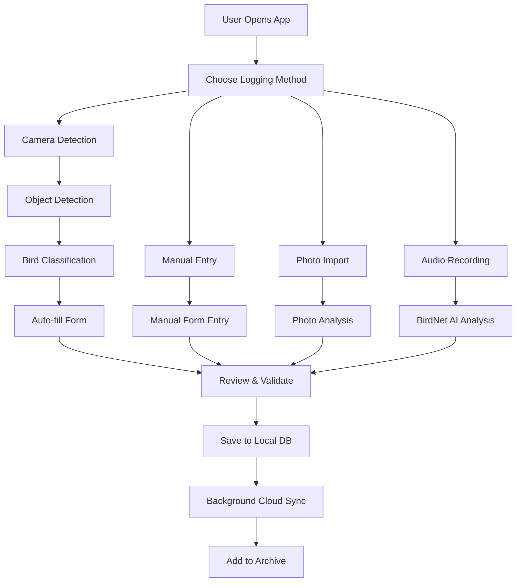
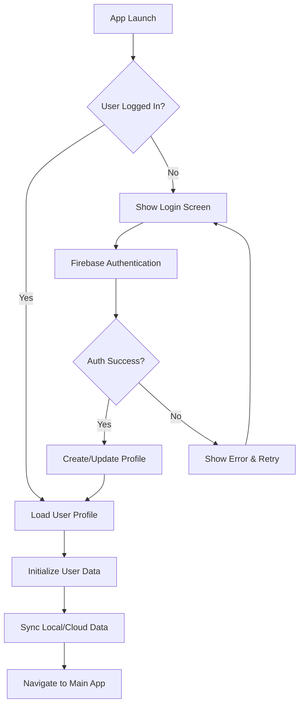
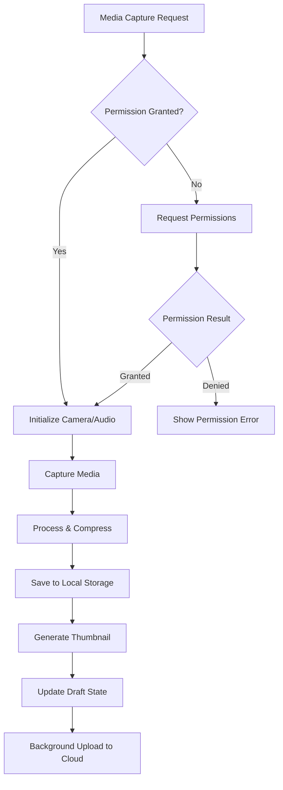
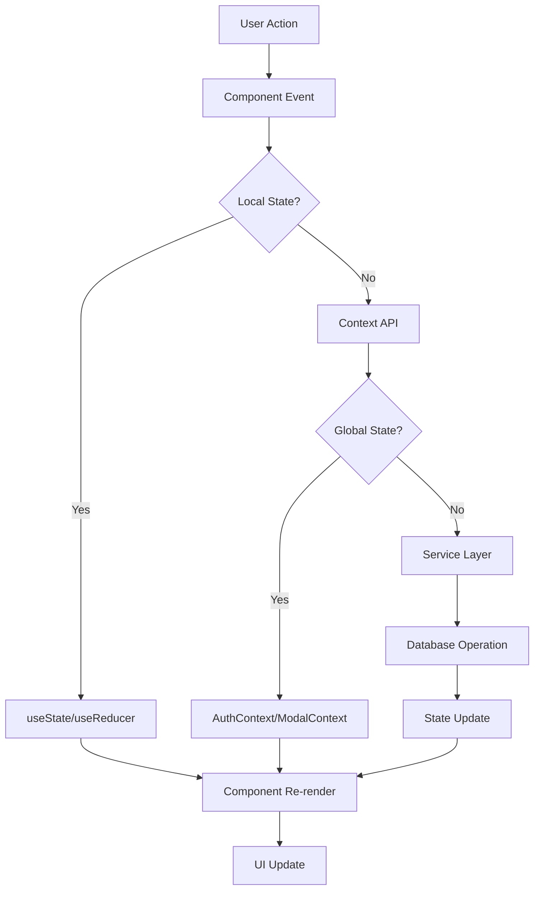
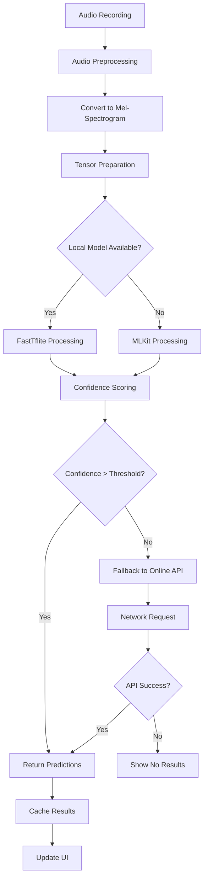
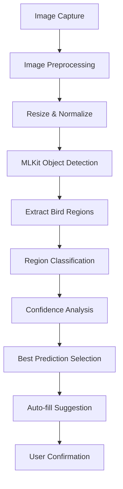
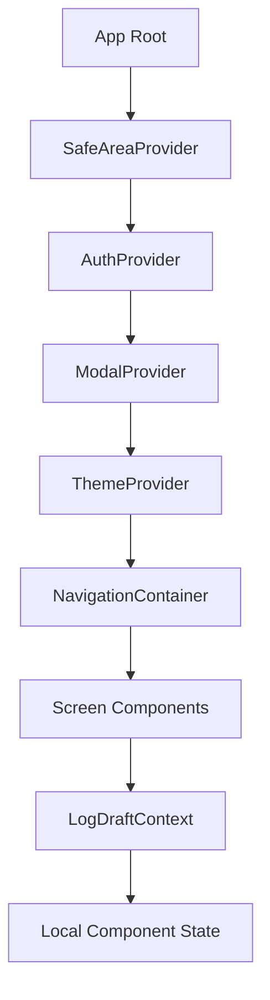
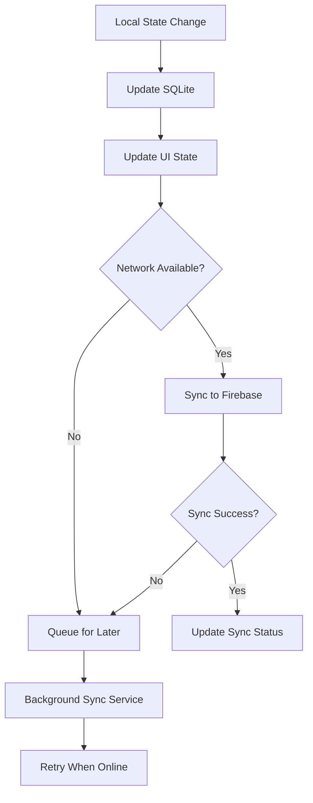
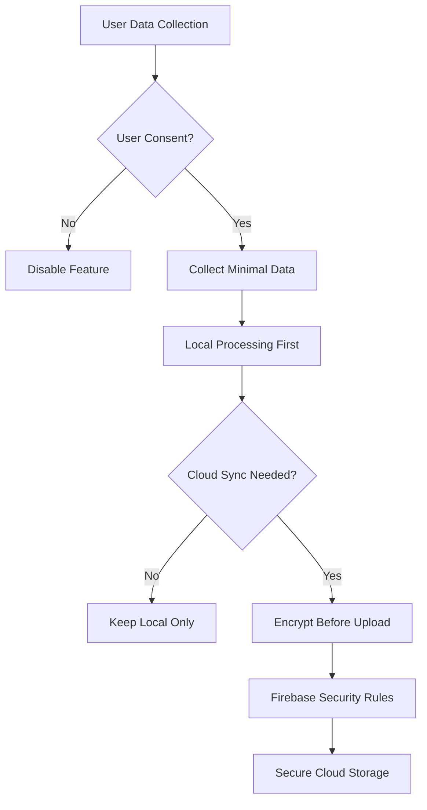

# LogChirpy App Architecture & Functionality Pipeline

## 📋 Table of Contents

1. [Overview](#overview)
2. [Architecture Patterns](#architecture-patterns)
3. [Core Features Pipeline](#core-features-pipeline)
4. [Data Flow Architecture](#data-flow-architecture)
5. [ML/AI Pipeline](#mlai-pipeline)
6. [Component System](#component-system)
7. [State Management](#state-management)
8. [Navigation & Routing](#navigation--routing)
9. [Services Layer](#services-layer)
10. [Security & Privacy](#security--privacy)
11. [Performance Optimizations](#performance-optimizations)
12. [Development Guidelines](#development-guidelines)

---

## 🏗️ Overview

LogChirpy is a **React Native cross-platform mobile application** for bird spotting and identification. Built with modern architecture patterns, it combines **local-first data storage** with **cloud synchronization**, **offline-first ML/AI capabilities**, and **enterprise-grade user experience**.

### **Core Technology Stack**
- **Framework**: React Native with Expo SDK 52
- **Language**: TypeScript with strict type checking
- **Navigation**: Expo Router (file-based routing)
- **State Management**: React Context + useReducer patterns
- **Database**: SQLite with custom ORM layer
- **Cloud**: Firebase (Authentication, Firestore, Storage)
- **ML/AI**: TensorFlow Lite, MLKit, FastTflite, BirdNet
- **UI**: Custom design system with responsive components

---

## 🎯 Architecture Patterns

### **1. Layer-Based Architecture**

```
┌─────────────────────────────────────────┐
│           PRESENTATION LAYER            │
│  ┌─────────────┐ ┌─────────────────────┐ │
│  │   Screens   │ │   Components        │ │
│  │   /app/     │ │   /components/      │ │
│  └─────────────┘ └─────────────────────┘ │
└─────────────────────────────────────────┘
┌─────────────────────────────────────────┐
│           BUSINESS LOGIC LAYER          │
│  ┌─────────────┐ ┌─────────────────────┐ │
│  │   Contexts  │ │   Custom Hooks      │ │
│  │   /context/ │ │   /hooks/           │ │
│  └─────────────┘ └─────────────────────┘ │
└─────────────────────────────────────────┘
┌─────────────────────────────────────────┐
│            SERVICES LAYER               │
│  ┌─────────────┐ ┌─────────────────────┐ │
│  │  Services   │ │   ML/AI Services    │ │
│  │  /services/ │ │   /services/        │ │
│  └─────────────┘ └─────────────────────┘ │
└─────────────────────────────────────────┘
┌─────────────────────────────────────────┐
│             DATA LAYER                  │
│  ┌─────────────┐ ┌─────────────────────┐ │
│  │   SQLite    │ │   Firebase          │ │
│  │   Local DB  │ │   Cloud Storage     │ │
│  └─────────────┘ └─────────────────────┘ │
└─────────────────────────────────────────┘
```

### **2. Local-First Architecture**
- **Primary**: SQLite local database for immediate access
- **Secondary**: Firebase cloud sync for backup and multi-device
- **Offline-First**: Full functionality without internet connection
- **Background Sync**: Automatic cloud synchronization when online

### **3. Modular Design System**
- **Atomic Components**: Base themed components (ThemedText, ThemedView)
- **Molecular Components**: Composite UI elements (Cards, Buttons, Modals)
- **Organism Components**: Complex UI sections (Forms, Lists, Navigation)
- **Template Components**: Screen layouts and page structures

---

## 🔄 Core Features Pipeline

### **1. Bird Spotting Workflow**



### **2. Authentication Flow**



### **3. Media Capture Pipeline**



---

## 📊 Data Flow Architecture

### **1. Data Sources & Storage**

```
┌─────────────────────────────────────────┐
│            DATA SOURCES                 │
├─────────────────────────────────────────┤
│  📱 User Input (Forms, Voice, Touch)    │
│  📷 Camera (Photos, Videos)              │
│  🎤 Microphone (Audio Recordings)       │
│  📍 GPS (Location Data)                 │
│  🧠 ML Models (AI Predictions)          │
│  ☁️  Firebase (Cloud Data)              │
└─────────────────────────────────────────┘
           │
           ▼
┌─────────────────────────────────────────┐
│           DATA PROCESSING               │
├─────────────────────────────────────────┤
│  🔄 Validation & Sanitization           │
│  📏 Compression & Optimization          │
│  🔐 Encryption & Security               │
│  🎯 ML Preprocessing                    │
└─────────────────────────────────────────┘
           │
           ▼
┌─────────────────────────────────────────┐
│            DATA STORAGE                 │
├─────────────────────────────────────────┤
│  🗄️  SQLite (Primary Local Storage)     │
│  💾 AsyncStorage (App Preferences)      │
│  📁 File System (Media Files)           │
│  ☁️  Firebase (Cloud Backup)            │
└─────────────────────────────────────────┘
```

### **2. State Management Flow**



### **3. Draft Management System**

```typescript
// Draft State Structure
interface BirdSpottingDraft {
  // Core Data
  birdType: string
  date: string
  location: string
  notes: string
  
  // Media
  imageUri?: string
  videoUri?: string
  audioUri?: string
  
  // GPS
  gpsLat?: number
  gpsLng?: number
  
  // AI Results
  aiPrediction?: string
  confidence?: number
  
  // Metadata
  createdAt: string
  updatedAt: string
  completionPercentage: number
}
```

---

## 🤖 ML/AI Pipeline

### **1. BirdNet Audio Identification**



### **2. Image Classification Pipeline**



### **3. Model Management**

```typescript
// Model Service Architecture
interface ModelService {
  // Model Loading
  loadModel(): Promise<boolean>
  isModelReady(): boolean
  
  // Inference
  classify(input: ProcessedInput): Promise<Prediction[]>
  
  // Performance
  getMemoryUsage(): MemoryStats
  getInferenceTime(): number
  
  // Cleanup
  dispose(): void
}

// Service Implementations
- FastTfliteBirdClassifier (Primary)
- MLKitBirdClassifier (Fallback)
- BirdNetService (Orchestrator)
```

---

## 🎨 Component System

### **1. Design System Architecture**

```
┌─────────────────────────────────────────┐
│            DESIGN TOKENS               │
├─────────────────────────────────────────┤
│  🎨 Colors (Light/Dark Themes)          │
│  📏 Typography (Font Sizes & Weights)   │
│  🔲 Spacing (Margins, Paddings)         │
│  🎭 Shadows & Elevations               │
│  🔘 Border Radius & Borders            │
└─────────────────────────────────────────┘
           │
           ▼
┌─────────────────────────────────────────┐
│           BASE COMPONENTS               │
├─────────────────────────────────────────┤
│  📝 ThemedText                          │
│  📦 ThemedView                          │
│  🔘 ThemedPressable                     │
│  🖼️  ThemedIcon                          │
│  📱 ThemedSafeAreaView                  │
└─────────────────────────────────────────┘
           │
           ▼
┌─────────────────────────────────────────┐
│          COMPOSITE COMPONENTS           │
├─────────────────────────────────────────┤
│  🎴 ModernCard                          │
│  🔘 Button (Multiple Variants)          │
│  📋 Section                             │
│  🎭 Modal Components                    │
│  📱 CameraControls                      │
└─────────────────────────────────────────┘
           │
           ▼
┌─────────────────────────────────────────┐
│           SCREEN COMPONENTS             │
├─────────────────────────────────────────┤
│  📱 Camera Screen                       │
│  📝 Manual Entry Screen                 │
│  📋 Archive Screen                      │
│  👤 Account Screen                      │
│  🔍 BirdDex Screen                      │
└─────────────────────────────────────────┘
```

### **2. Modal System Architecture**

```typescript
// Centralized Modal Management
interface ModalSystem {
  // Modal Types
  'date-picker': DatePickerModalProps
  'video-player': VideoPlayerModalProps
  'bird-predictions': BirdPredictionsModalProps
  'photo-preview': PhotoPreviewModalProps
  'confirmation': ConfirmationModalProps
  'loading': LoadingModalProps
}

// Usage Pattern
const { showModal } = useModal()
showModal({
  type: 'confirmation',
  props: {
    title: 'Delete Entry?',
    message: 'This action cannot be undone.',
    onConfirm: handleDelete
  }
})
```

### **3. Z-Index Layer System**

```typescript
// Consistent UI Layering
export const Z_LAYERS = {
  CONTENT: 1,           // Main app content
  OVERLAYS: 10,         // Status badges, tooltips
  NAVIGATION: 50,       // Tab bars, headers
  CAMERA_OVERLAYS: 100, // Camera UI elements
  MODALS: 1000,         // Modal dialogs
  NOTIFICATIONS: 2000,  // Snackbars, toasts
  ALERTS: 3000         // Critical system alerts
}
```

---

## 🔄 State Management

### **1. Context Providers Hierarchy**



### **2. State Categories**

```typescript
// Global State (Context)
interface GlobalState {
  auth: AuthState           // User authentication
  modal: ModalState         // Modal management
  theme: ThemeState         // Dark/light mode
  i18n: LanguageState      // Internationalization
}

// Screen State (Local)
interface ScreenState {
  loading: boolean          // Loading indicators
  errors: ErrorState[]      // Validation errors
  formData: FormState       // Form inputs
  ui: UIState              // Component visibility
}

// Persistent State (AsyncStorage/SQLite)
interface PersistentState {
  userPreferences: UserPrefs
  draftData: DraftState
  cacheData: CacheState
  offlineQueue: QueueState
}
```

### **3. Data Synchronization**



---

## 🧭 Navigation & Routing

### **1. App Navigation Structure**

```
📱 App Root
├── 🏠 (tabs)/               # Main Tab Navigation
│   ├── 📋 index             # Home/Dashboard
│   ├── 🔍 smart-search      # Smart Search
│   ├── 📚 birdex/           # Bird Encyclopedia
│   │   ├── index            # Species List
│   │   └── details/[code]   # Species Detail
│   ├── 📁 archive/          # User's Archive
│   │   ├── index            # Archive List
│   │   ├── gallery          # Photo Gallery
│   │   └── detail/[id]      # Entry Detail
│   ├── ⚙️ settings          # App Settings
│   └── 👤 account/          # User Account
│       ├── index            # Profile
│       └── (auth)/          # Authentication
│           ├── login        # Login Screen
│           ├── signup       # Registration
│           └── forgot-password
└── ✏️ log/                  # Logging Workflows
    ├── select               # Method Selection
    ├── camera              # Camera Capture
    ├── photo               # Photo Import
    ├── video               # Video Recording
    ├── audio               # Audio Recording
    ├── manual              # Manual Entry
    ├── photo-selection     # Batch Photo Management
    └── objectIdentCamera  # AI Camera Detection
```

### **2. Navigation Patterns**

```typescript
// Screen Navigation
import { router } from 'expo-router'

// Push to stack
router.push('/log/camera')

// Replace current screen
router.replace('/account/login')

// Go back
router.back()

// Navigate with parameters
router.push({
  pathname: '/archive/detail/[id]',
  params: { id: entry.id }
})
```

### **3. Deep Linking Support**

```typescript
// URL Scheme: logchirpy://
// Examples:
// logchirpy://birdex/details/AMRO    # American Robin
// logchirpy://archive/detail/123     # Archive Entry
// logchirpy://log/camera             # Open Camera
```

---

## ⚙️ Services Layer

### **1. Service Architecture**

```typescript
// Core Services
interface ServiceLayer {
  // Data Services
  database: DatabaseService        // SQLite operations
  sync: SyncService               // Cloud synchronization
  userProfile: UserProfileService // User management
  
  // Media Services
  audioDecoder: AudioDecoderService
  camera: CameraService
  media: MediaCompressionService
  
  // AI/ML Services
  birdNet: BirdNetService
  mlkit: MLKitService
  fastTflite: FastTfliteService
  
  // External Services
  wikipedia: WikipediaService     // Species information
  location: LocationService      // GPS services
}
```

### **2. Database Service**

```sql
-- Core Tables Schema
CREATE TABLE bird_spottings (
  id INTEGER PRIMARY KEY AUTOINCREMENT,
  bird_type TEXT NOT NULL,
  date TEXT NOT NULL,
  location TEXT,
  notes TEXT,
  image_uri TEXT,
  video_uri TEXT,
  audio_uri TEXT,
  gps_lat REAL,
  gps_lng REAL,
  ai_prediction TEXT,
  confidence REAL,
  created_at TEXT DEFAULT CURRENT_TIMESTAMP,
  updated_at TEXT DEFAULT CURRENT_TIMESTAMP,
  synced INTEGER DEFAULT 0
);

CREATE TABLE user_preferences (
  id INTEGER PRIMARY KEY,
  language TEXT DEFAULT 'en',
  theme TEXT DEFAULT 'auto',
  gps_enabled INTEGER DEFAULT 1,
  ai_enabled INTEGER DEFAULT 1,
  notifications_enabled INTEGER DEFAULT 1
);

CREATE TABLE bird_species (
  code TEXT PRIMARY KEY,
  common_name TEXT NOT NULL,
  scientific_name TEXT NOT NULL,
  family TEXT,
  order_name TEXT,
  conservation_status TEXT,
  habitat TEXT,
  region TEXT
);
```

### **3. Cloud Sync Service**

```typescript
interface SyncService {
  // Sync Operations
  syncUserData(): Promise<SyncResult>
  syncMediaFiles(): Promise<SyncResult>
  syncBirdSpottings(): Promise<SyncResult>
  
  // Conflict Resolution
  resolveConflicts(conflicts: DataConflict[]): Promise<Resolution[]>
  
  // Background Sync
  enableBackgroundSync(): void
  scheduleSync(interval: number): void
  
  // Offline Queue
  queueForSync(operation: SyncOperation): void
  processOfflineQueue(): Promise<void>
}
```

---

## 🔒 Security & Privacy

### **1. Data Protection**

```typescript
interface SecurityMeasures {
  // Authentication
  firebaseAuth: FirebaseAuth       // Secure user authentication
  sessionManagement: SessionManager // Token management
  
  // Data Encryption
  localEncryption: EncryptionService // SQLite encryption
  fileEncryption: FileEncryption     // Media file protection
  
  // Privacy
  locationPrivacy: LocationPrivacy   // GPS data anonymization
  dataMinimization: DataPolicy      // Minimal data collection
  
  // Permissions
  permissionManager: PermissionService // Runtime permissions
}
```

### **2. Privacy Controls**



### **3. Permission Management**

```typescript
// Required Permissions
interface AppPermissions {
  camera: 'required'        // Photo/video capture
  microphone: 'required'    // Audio recording
  location: 'optional'      // GPS tagging
  mediaLibrary: 'optional'  // Photo import
  storage: 'required'       // Local data storage
}

// Permission Flow
const requestPermissions = async () => {
  const camera = await Camera.requestPermissionAsync()
  const audio = await Audio.requestPermissionsAsync()
  const location = await Location.requestForegroundPermissionsAsync()
  
  return { camera, audio, location }
}
```

---

## ⚡ Performance Optimizations

### **1. Rendering Optimizations**

```typescript
// Performance Patterns
export const OptimizedComponent = React.memo(({ data }) => {
  // Memoized calculations
  const processedData = useMemo(() => 
    expensiveCalculation(data), [data]
  )
  
  // Stable callbacks
  const handlePress = useCallback((id) => {
    onItemPress(id)
  }, [onItemPress])
  
  // Lazy loading
  return (
    <FlatList
      data={processedData}
      renderItem={renderItem}
      keyExtractor={keyExtractor}
      getItemLayout={getItemLayout}  // Skip measurement
      maxToRenderPerBatch={10}       // Limit initial render
      windowSize={5}                 // Optimize memory
    />
  )
})
```

### **2. Asset Optimization**

```typescript
// Image Optimization
const compressImage = async (uri: string): Promise<string> => {
  return await ImageManipulator.manipulateAsync(uri, [], {
    compress: 0.7,
    format: ImageManipulator.SaveFormat.JPEG,
    base64: false
  })
}

// Audio Optimization
const audioConfig = {
  android: {
    extension: '.m4a',
    outputFormat: Audio.RECORDING_FORMAT_MPEG_4,
    audioEncoder: Audio.RECORDING_OPTION_ANDROID_AUDIO_ENCODER_AAC,
    sampleRate: 44100,
    numberOfChannels: 1,
    bitRate: 128000,
  },
  ios: {
    extension: '.m4a',
    outputFormat: Audio.RECORDING_FORMAT_MPEG_4_AAC,
    audioQuality: Audio.RECORDING_QUALITY_HIGH,
    sampleRate: 44100,
    numberOfChannels: 1,
    bitRate: 128000,
  }
}
```

### **3. Memory Management**

```typescript
// ML Model Memory Management
class ModelManager {
  private models = new Map<string, LoadedModel>()
  private maxMemoryUsage = 100 * 1024 * 1024 // 100MB
  
  async loadModel(name: string): Promise<LoadedModel> {
    // Check memory usage
    if (this.getMemoryUsage() > this.maxMemoryUsage) {
      await this.cleanupUnusedModels()
    }
    
    // Load model with proper cleanup
    const model = await this.loadModelFromFile(name)
    this.models.set(name, model)
    
    return model
  }
  
  cleanup(): void {
    this.models.forEach(model => model.dispose())
    this.models.clear()
  }
}
```

### **4. Database Performance**

```sql
-- Optimized Indexes
CREATE INDEX idx_spottings_date ON bird_spottings(date);
CREATE INDEX idx_spottings_location ON bird_spottings(gps_lat, gps_lng);
CREATE INDEX idx_spottings_bird_type ON bird_spottings(bird_type);
CREATE INDEX idx_spottings_sync ON bird_spottings(synced);

-- Query Optimization
PRAGMA journal_mode = WAL;        -- Better concurrency
PRAGMA synchronous = NORMAL;      -- Balanced safety/speed
PRAGMA cache_size = 10000;        -- Larger cache
PRAGMA temp_store = memory;       -- In-memory temp tables
```

---

## 🛠️ Development Guidelines

### **1. Code Organization**

```
/src
├── /app                  # Expo Router screens
│   ├── /(tabs)          # Tab navigation screens
│   ├── /log             # Logging workflow screens
│   └── /context         # React contexts
├── /components          # Reusable UI components
│   ├── /modals         # Modal components
│   ├── /animations     # Animation components
│   └── /themed         # Design system components
├── /services           # Business logic & API services
├── /hooks              # Custom React hooks
├── /constants          # App constants & configuration
├── /types              # TypeScript type definitions
├── /i18n               # Internationalization
└── /assets             # Static assets
```

### **2. Naming Conventions**

```typescript
// Files & Folders
PascalCase      // Components: ThemedButton.tsx
camelCase       // Services: birdNetService.ts
kebab-case      // Screens: smart-search.tsx
UPPER_CASE      // Constants: API_ENDPOINTS.ts

// Variables & Functions
camelCase       // Variables: birdSpecies, isLoading
PascalCase      // Components: <ThemedText />
UPPER_CASE      // Constants: MAX_FILE_SIZE
```

### **3. Component Patterns**

```typescript
// Standard Component Structure
interface ComponentProps {
  // Props definition
}

export const ComponentName: React.FC<ComponentProps> = ({
  prop1,
  prop2 = defaultValue
}) => {
  // 1. Hooks (state, context, etc.)
  // 2. Computed values
  // 3. Event handlers
  // 4. Effects
  // 5. Render functions
  // 6. Return JSX
}

// Export patterns
export default ComponentName           // Default export
export { ComponentName }              // Named export
export type { ComponentProps }        // Type export
```

### **4. Error Handling**

```typescript
// Service Error Handling
interface ServiceResult<T> {
  success: boolean
  data?: T
  error?: string
  code?: ErrorCode
}

// Component Error Boundaries
class ErrorBoundary extends React.Component {
  componentDidCatch(error: Error, errorInfo: ErrorInfo) {
    // Log error to crash analytics
    crashlytics().recordError(error)
    
    // Update UI state
    this.setState({ hasError: true })
  }
}

// Async Error Handling
const handleAsyncOperation = async () => {
  try {
    const result = await riskyOperation()
    return { success: true, data: result }
  } catch (error) {
    console.error('Operation failed:', error)
    return { 
      success: false, 
      error: error instanceof Error ? error.message : 'Unknown error'
    }
  }
}
```

### **5. Testing Strategy**

```typescript
// Unit Tests
describe('BirdNetService', () => {
  it('should classify bird audio correctly', async () => {
    const mockAudio = createMockAudioFile()
    const result = await BirdNetService.identifyBird(mockAudio)
    
    expect(result.success).toBe(true)
    expect(result.predictions).toHaveLength(3)
    expect(result.predictions[0].confidence).toBeGreaterThan(0.5)
  })
})

// Integration Tests
describe('Manual Entry Flow', () => {
  it('should save entry to database', async () => {
    render(<ManualEntryScreen />)
    
    // Fill form
    fireEvent.changeText(getByTestId('bird-type-input'), 'American Robin')
    fireEvent.press(getByTestId('save-button'))
    
    // Verify database
    const entries = await database.getAllEntries()
    expect(entries).toHaveLength(1)
    expect(entries[0].birdType).toBe('American Robin')
  })
})
```

---

## 🚀 Deployment & Maintenance

### **1. Build Configuration**

```typescript
// app.config.ts
export default {
  expo: {
    name: "LogChirpy",
    slug: "logchirpy",
    version: "1.0.0",
    
    // Platform-specific configs
    ios: {
      bundleIdentifier: "com.logchirpy.app",
      buildNumber: "1.0.0"
    },
    android: {
      package: "com.logchirpy.app",
      versionCode: 1
    },
    
    // Permissions
    permissions: [
      "CAMERA",
      "RECORD_AUDIO",
      "ACCESS_FINE_LOCATION",
      "READ_EXTERNAL_STORAGE"
    ]
  }
}
```

### **2. Environment Configuration**

```typescript
// Environment Variables
interface Environment {
  NODE_ENV: 'development' | 'staging' | 'production'
  API_BASE_URL: string
  FIREBASE_CONFIG: FirebaseConfig
  SENTRY_DSN?: string
  ANALYTICS_KEY?: string
}

// Config per environment
const config = {
  development: {
    API_BASE_URL: 'http://localhost:3000',
    DEBUG_MODE: true
  },
  production: {
    API_BASE_URL: 'https://api.logchirpy.com',
    DEBUG_MODE: false
  }
}
```

### **3. Monitoring & Analytics**

```typescript
// Crash Reporting
import crashlytics from '@react-native-firebase/crashlytics'

// Performance Monitoring
import perf from '@react-native-firebase/perf'

// User Analytics
import analytics from '@react-native-firebase/analytics'

// Usage Tracking
const trackUserAction = (action: string, parameters?: object) => {
  analytics().logEvent(action, parameters)
}
```

---

## 📈 Future Roadmap

### **Planned Enhancements**
1. **Advanced ML Features**
   - Real-time video bird detection
   - Habitat classification
   - Migration pattern analysis

2. **Social Features**
   - Community bird spotting
   - Photo sharing
   - Leaderboards and achievements

3. **Data Visualization**
   - Spotting statistics and trends
   - Interactive maps
   - Species identification accuracy

4. **Platform Expansion**
   - Web companion app
   - Apple Watch integration
   - Desktop synchronization

This architecture provides a solid foundation for current functionality while maintaining flexibility for future enhancements and scale.